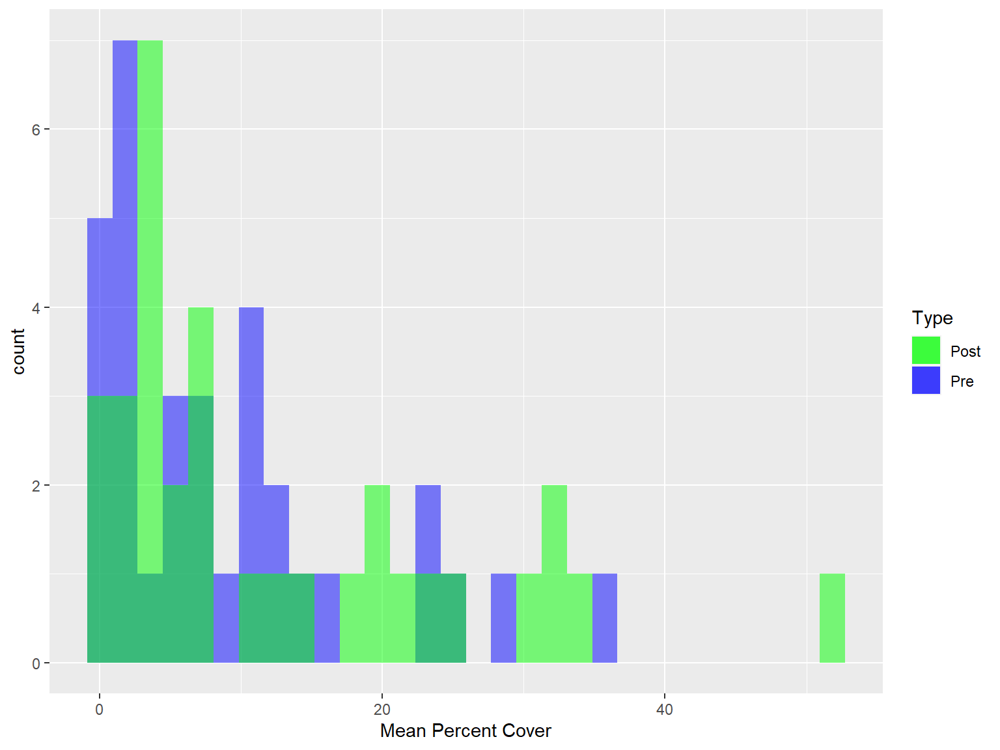

## The Data

This data set consists of abundance data on the sea star "Pisaster ochraceus" and local mussels species in the rocky intertidal zones along California' coast. The data set primarily focuses on changes in abundance data for both animals before and after an occurence of Sea Star Wasting Syndrome (SSWS) causes mass sea star mortality. This mini project will only look into the mean percent cover of mussels pre-SSWS and post-SSWS.


## The relationship between sea stars and mussels

The sea star "Pisaster ochraceus" is a commonly known key stone predator for rocky intertidal communities. As a keystone predator these sea stars keep populations of competitively dominant species (mussels) in check. Some advantages of their role in intertidal communities include:

- Reducing competition for space
- Maintaining populations of producers (i.e kelp) and their consumers
- Keeping biodiversity high


## Sea Star Wastinging Syndrome (SSWS)

Though not much is known about the causes of SSWS, the disease can be fatal to sea stars and has been known to cause mass sea star mortality in rocky intertidal zones. The disease begins with lesions and eventually deterioration of the sea star's body, ending in death. The picture below shows a sea star with the disease. 


## Reading in and Viewing the dataset


```r
abundance_data <- read.csv("data/change in pisaster and mussels PISCO sites.csv")
```


```r
knitr::kable(abundance_data)
```


|ï..site                   |      Lat|      Long|georegion        | Mean.percent_cover_Mytcal..pre.SSWS| Mean.percent_cover_Mytcal..post.SSWS| Mean.Pisaster.density..pre.SSWS| Mean.Pisaster.density..post.SSWS| change_mussel_cover| change_pisaster_density| Square.Root.change_mussel_cover.| Square.Root.change_pisaster_density.| Square.Root.Mean.Pisaster.density..pre.SSWS.| Square.Root.Mean.Pisaster.density..post.SSWS.| Square.Root.Mean.percent_cover_Mytcal..pre.SSWS.| Square.Root.Mean.percent_cover_Mytcal..post.SSWS.|
|:-------------------------|--------:|---------:|:----------------|-----------------------------------:|------------------------------------:|-------------------------------:|--------------------------------:|-------------------:|-----------------------:|--------------------------------:|------------------------------------:|--------------------------------------------:|---------------------------------------------:|------------------------------------------------:|-------------------------------------------------:|
|Alegria                   | 34.46714| -120.2782|CA South         |                           8.4506761|                            3.2450897|                       0.0502500|                           0.0010|          -5.2055864|              -0.0492500|                       -2.2815754|                           -0.2219234|                                    0.2241651|                                     0.0316228|                                        2.9070047|                                         1.8014132|
|Andrew Molera             | 36.28060| -121.8632|CA Central       |                           0.4792557|                            3.1881804|                       0.0830000|                           0.0890|           2.7089247|               0.0060000|                        1.6458811|                            0.0774597|                                    0.2880972|                                     0.2983287|                                        0.6922830|                                         1.7855476|
|Ano Nuevo                 | 37.11257| -122.3296|CA Central       |                           1.3506452|                            2.8458498|                       0.0140000|                           0.0060|           1.4952046|              -0.0080000|                        1.2227856|                           -0.0894427|                                    0.1183216|                                     0.0774597|                                        1.1621726|                                         1.6869647|
|Arroyo Hondo              | 34.47331| -120.1454|CA South         |                          10.0139276|                            5.2158273|                       0.1150000|                           0.0020|          -4.7981002|              -0.1130000|                       -2.1904566|                           -0.3361547|                                    0.3391165|                                     0.0447214|                                        3.1644790|                                         2.2838186|
|Bodega                    | 38.31819| -123.0736|CA North Central |                          35.4270636|                           51.9774011|                       0.7052000|                           1.3240|          16.5503375|               0.6188000|                        4.0682106|                            0.7866384|                                    0.8397619|                                     1.1506520|                                        5.9520638|                                         7.2095354|
|Cape Mendocino            | 40.34118| -124.3630|CA North         |                           4.7315860|                            6.8936170|                       0.1570000|                           0.0360|           2.1620310|              -0.1210000|                        1.4703847|                           -0.3478505|                                    0.3962323|                                     0.1897367|                                        2.1752209|                                         2.6255698|
|Cayucos                   | 35.44747| -120.9501|CA Central       |                           1.9361648|                            0.9734513|                       0.0130000|                           0.0000|          -0.9627135|              -0.0130000|                       -0.9811796|                           -0.1140175|                                    0.1140175|                                     0.0000000|                                        1.3914614|                                         0.9866364|
|Chimney Rock              | 37.99383| -122.9673|CA North Central |                           0.8250825|                            3.4843206|                       0.2170000|                           0.0790|           2.6592380|              -0.1380000|                        1.6307170|                           -0.3714835|                                    0.4658326|                                     0.2810694|                                        0.9083405|                                         1.8666335|
|Coal Oil Point            | 34.40686| -119.8783|CA South         |                           5.8828045|                            2.5225225|                       0.0013333|                           0.0020|          -3.3602820|               0.0006667|                       -1.8331072|                            0.0258199|                                    0.0365148|                                     0.0447214|                                        2.4254493|                                         1.5882451|
|Damnation Creek           | 41.65301| -124.1301|CA North         |                           0.9000900|                            2.7466530|                       1.0110000|                           0.1470|           1.8465630|              -0.8640000|                        1.3588830|                           -0.9295160|                                    1.0054850|                                     0.3834058|                                        0.9487307|                                         1.6573029|
|Del Mar Landing           | 38.74051| -123.5109|CA North Central |                          11.6099071|                           18.6963979|                       0.2180000|                           0.6970|           7.0864908|               0.4790000|                        2.6620464|                            0.6920983|                                    0.4669047|                                     0.8348653|                                        3.4073314|                                         4.3239332|
|Diablo                    | 35.22659| -120.8737|CA Central       |                           1.6000000|                            2.2007042|                       0.0170000|                           0.0030|           0.6007042|              -0.0140000|                        0.7750511|                           -0.1183216|                                    0.1303840|                                     0.0547723|                                        1.2649111|                                         1.4834771|
|Duck Island               | 51.90473| -128.4811|BC               |                          16.8308703|                           24.4897959|                       0.2920000|                           0.4160|           7.6589256|               0.1240000|                        2.7674764|                            0.3521363|                                    0.5403702|                                     0.6449806|                                        4.1025444|                                         4.9487166|
|Ecola                     | 45.91810| -123.9805|OR               |                          22.6535317|                           31.9502075|                       0.3810000|                           0.1130|           9.2966757|              -0.2680000|                        3.0490451|                           -0.5176872|                                    0.6172520|                                     0.3361547|                                        4.7595726|                                         5.6524515|
|Fitzgerald Marine Reserve | 37.52165| -122.5168|CA North Central |                           0.4175987|                            0.7901668|                       0.0260000|                           0.0060|           0.3725681|              -0.0200000|                        0.6103836|                           -0.1414214|                                    0.1612452|                                     0.0774597|                                        0.6462188|                                         0.8889133|
|Gerstle Cove              | 38.56614| -123.3292|CA North Central |                           6.5432099|                           21.3289036|                       0.0500000|                           0.6690|          14.7856938|               0.6190000|                        3.8452170|                            0.7867655|                                    0.2236068|                                     0.8179242|                                        2.5579699|                                         4.6183226|
|Government Point          | 34.44240| -120.4564|CA South         |                          12.3909948|                           15.0709220|                       0.3285000|                           0.0730|           2.6799272|              -0.2555000|                        1.6370483|                           -0.5054701|                                    0.5731492|                                     0.2701851|                                        3.5200845|                                         3.8821285|
|Hazards                   | 35.28962| -120.8833|CA Central       |                           1.4845840|                            2.9255319|                       0.0535000|                           0.0960|           1.4409479|               0.0425000|                        1.2003949|                            0.2061553|                                    0.2313007|                                     0.3098387|                                        1.2184351|                                         1.7104186|
|Hopkins                   | 36.62102| -121.9070|CA Central       |                           1.3231817|                            6.7278287|                       0.1315000|                           0.0270|           5.4046471|              -0.1045000|                        2.3247897|                           -0.3232646|                                    0.3626293|                                     0.1643168|                                        1.1502964|                                         2.5938058|
|Kibesillah Hill           | 39.60413| -123.7888|CA North         |                          24.7284307|                           31.7154812|                       0.3596667|                           0.0590|           6.9870505|              -0.3006667|                        2.6433029|                           -0.5483308|                                    0.5997222|                                     0.2428992|                                        4.9727689|                                         5.6316500|
|Mussel Shoals             | 34.35557| -119.4407|CA South         |                          10.1754386|                           11.2511251|                       0.1040000|                           0.0480|           1.0756865|              -0.0560000|                        1.0371531|                           -0.2366432|                                    0.3224903|                                     0.2190890|                                        3.1898963|                                         3.3542697|
|Piedras Blancas           | 35.66568| -121.2865|CA Central       |                           4.8859935|                           13.0513051|                       1.0280000|                           0.1690|           8.1653116|              -0.8590000|                        2.8575009|                           -0.9268225|                                    1.0139033|                                     0.4110961|                                        2.2104284|                                         3.6126590|
|Point Arena               | 38.94337| -123.7330|CA North Central |                           0.1647446|                            0.5444646|                       0.0170000|                           0.0640|           0.3797200|               0.0470000|                        0.6162142|                            0.2167948|                                    0.1303840|                                     0.2529822|                                        0.4058875|                                         0.7378785|
|Point Lobos               | 36.51317| -121.9447|CA Central       |                           2.8016813|                            4.1843116|                       0.0155000|                           0.0115|           1.3826304|              -0.0040000|                        1.1758530|                           -0.0632456|                                    0.1244990|                                     0.1072381|                                        1.6738224|                                         2.0455590|
|Point Pinos               | 36.63797| -121.9376|CA Central       |                           6.8468469|                           20.1620162|                       0.2360000|                           0.0000|          13.3151693|              -0.2360000|                        3.6489957|                           -0.4857983|                                    0.4857983|                                     0.0000000|                                        2.6166480|                                         4.4902134|
|Point Sierra Nevada       | 35.72883| -121.3184|CA Central       |                          11.1730974|                           19.9196787|                       0.1683333|                           0.1740|           8.7465813|               0.0056667|                        2.9574620|                            0.0752773|                                    0.4102845|                                     0.4171331|                                        3.3426183|                                         4.4631467|
|Saunders Reef             | 38.86138| -123.6536|CA North Central |                           0.1510574|                            0.2590674|                       0.0100000|                           0.0150|           0.1080100|               0.0050000|                        0.3286487|                            0.0707107|                                    0.1000000|                                     0.1224745|                                        0.3886610|                                         0.5089866|
|Scott Creek               | 37.04628| -122.2379|CA Central       |                          14.7890824|                           33.8235294|                       0.2180000|                           0.2530|          19.0344471|               0.0350000|                        4.3628485|                            0.1870829|                                    0.4669047|                                     0.5029911|                                        3.8456576|                                         5.8158000|
|Shaws Cove                | 33.54473| -117.7997|CA South         |                          23.7773514|                            7.4657534|                       0.0446667|                           0.0000|         -16.3115980|              -0.0446667|                       -4.0387619|                           -0.2113449|                                    0.2113449|                                     0.0000000|                                        4.8762026|                                         2.7323531|
|Shelter Cove              | 40.02274| -124.0739|CA North         |                           7.9776846|                            4.9504950|                       0.5600000|                           0.0240|          -3.0271896|              -0.5360000|                       -1.7398821|                           -0.7321202|                                    0.7483315|                                     0.1549193|                                        2.8244795|                                         2.2249708|
|Stairs                    | 34.73062| -120.6152|CA Central       |                           1.2865428|                            7.6086956|                       0.0460000|                           0.0590|           6.3221528|               0.0130000|                        2.5143892|                            0.1140175|                                    0.2144761|                                     0.2428992|                                        1.1342587|                                         2.7583864|
|Stillwater                | 36.56093| -121.9404|CA Central       |                          13.1471877|                           24.0996377|                       0.2665000|                           0.0405|          10.9524500|              -0.2260000|                        3.3094486|                           -0.4753946|                                    0.5162364|                                     0.2012461|                                        3.6259051|                                         4.9091382|
|Terrace Point             | 36.94851| -122.0648|CA Central       |                          29.0299142|                           30.0778485|                       0.0835000|                           0.1120|           1.0479343|               0.0285000|                        1.0236866|                            0.1688194|                                    0.2889637|                                     0.3346640|                                        5.3879416|                                         5.4843275|


## Isolating the data

The data set contains more data than needed to work with. In the following code, the mean percent cover of mussels pre SSWS and post SSWS is isolated. This makes it easier to manipulate and graph the data. 


```r
abundance_data_v2 <- rename(abundance_data, pre_mean_mussel_cover = Mean.percent_cover_Mytcal..pre.SSWS,post_mean_mussel_cover = Mean.percent_cover_Mytcal..post.SSWS)
```


```r
mean_mussel_cover_data <- select(abundance_data_v2, c(pre_mean_mussel_cover, post_mean_mussel_cover))
```


```r
pre_cover_data <- select(abundance_data_v2, c(pre_mean_mussel_cover))

pre_cover_data_v2 <- rename(pre_cover_data, mean_percent_cover = pre_mean_mussel_cover)
```


```r
post_cover_data <-  select(abundance_data_v2, c(post_mean_mussel_cover))

post_cover_data_v2 <- rename(post_cover_data, mean_percent_cover = post_mean_mussel_cover)
```


## Histrogram comparing mussel abundance pre- and post-SSWS


```r
mean_cover_histogram <- rbind(pre_cover_data_v2, post_cover_data_v2)

mean_cover_histogram<- ggplot(mean_cover_histogram) + 
  geom_histogram(data=pre_cover_data_v2, aes(x=mean_percent_cover, fill = "Pre"), alpha = 0.5) +
  geom_histogram(data=post_cover_data_v2, aes(x=mean_percent_cover, fill = "Post"), alpha = 0.5) + 
  xlab("Mean Percent Cover") + 
  scale_fill_manual("Type", values = c(Pre = "blue", Post = "green"))

print(mean_cover_histogram)
```



